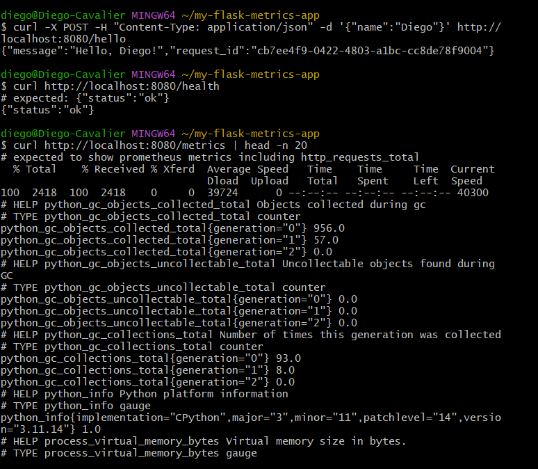

<content>
## 1) Executive Summary
  
**Problem:** Provide a tiny, reproducible web service that demonstrates core observability and service concepts (structured logging and basic metrics) from the course module. Target audience: instructors and students who need a minimal, containerized demo to inspect logs and metrics.

**Solution (non-technical):** This project creates a tiny Flask web service with a `/hello` endpoint and a `/metrics` endpoint. It logs every request in a readable format and keeps track of usage with basic metrics. The service is packaged in a Docker container, so it can be run with just one command, and the README explains how to use it.

---

## 2) System Overview

**Course Concept(s) used:**

* Structured logging (python-json-logger)
* Metrics instrumentation (prometheus-client)
* Containerization (Docker)
* Process server (gunicorn)

**Architecture Diagram:**
See `assets/architecture.png` (simple diagram: Client → Load Balancer (optional) → Docker container running Gunicorn/Flask → Logs (stdout) & /metrics endpoint for Prometheus scraping).

**Data/Models/Services:**

* No persistent data.
* Request/response JSON only.
* Licenses: MIT for code. Third-party libraries under their respective OSS licenses (see `requirements.txt`).

---

## 3) How to Run (Local)

### Build

```bash
docker build -t tiny-flask-metrics:latest .
```

### Run

```bash
docker run --rm -p 8080:8080 --env-file .env.example tiny-flask-metrics:latest
```

### Health & sample calls

```bash
curl http://localhost:8080/health
curl -X POST -H "Content-Type: application/json" -d '{"name":"Diego"}' http://localhost:8080/hello
curl http://localhost:8080/metrics
```

### Smoke tests

Start the service, then run:

```bash
pytest tests -q
```

---

## 4) Design Decisions

**Why these components?**

* Flask is minimal and clearly demonstrates an API.
* JSON logging shows how logs can be ingested into centralized logging systems.
* Prometheus client gives a standard, easy metric format for monitoring.
* Gunicorn gives a production-like server with multiple workers.

**Alternatives considered:**

* FastAPI for richer typing; not chosen for lack of minimalism.
* Adding a DB (maybe SQLite); not chosen to keep the container easy to deploy.

**Tradeoffs:**

* Simplicity vs features: small surface area but no persistence or auth.
* Single container: very easy deploy, but we would need additional work for scaling (metrics merge, logging aggregation).

**Security/Privacy:**

* No secrets in repo; `.env.example` provided.
* Input validation minimal (for demo only) — in production, validate all user inputs and sanitize logs to avoid leaking PII.

**Ops:**

* Logs to stdout (container-friendly).
* `/metrics` for scraping.
* Use Cloud Run or Fly.io for deployment (instructions below).

---

## 5) Results & Evaluation

**Screenshots / outputs:**
Here’s what the service shows when you run it. You can see its health, say hello, check metrics, and see logs.
Example outputs:



* JSON log lines printed to container stdout.
* Prometheus text output from `/metrics`.


**Performance notes:**

* Lightweight; two gunicorn workers with threaded workers are sufficient for demo load.
* Container memory footprint ~50–150MB depending on Python base image.

**Validation/tests performed:**

* `pytest` smoke tests against local server.
* Manual curl tests for `/hello`, `/health`, `/metrics`.

---

## 6) What’s Next

Possible extensions of this could include:

* Add tracing (OpenTelemetry).
* Demonstrate scraping and dashboards.
* Attach a logging sink (ELK / Loki?) and show structured log ingestion & queries.
* Add authentication and input validation.

---

## 7) Links

* GitHub Repo: https://github.com/ksdjf032/my-flask-metrics-app
* Public App: https://my-flask-metrics-app.fly.dev/

</content>

* `tests/test_api.py` — smoke tests
* `assets/architecture.png` — architecture diagram
* `requirements.txt` — pinned deps
---
* `Dockerfile` — containerization
* `src/logger.py` — structured JSON logger setup
* `src/app.py` — application logic and endpoints

